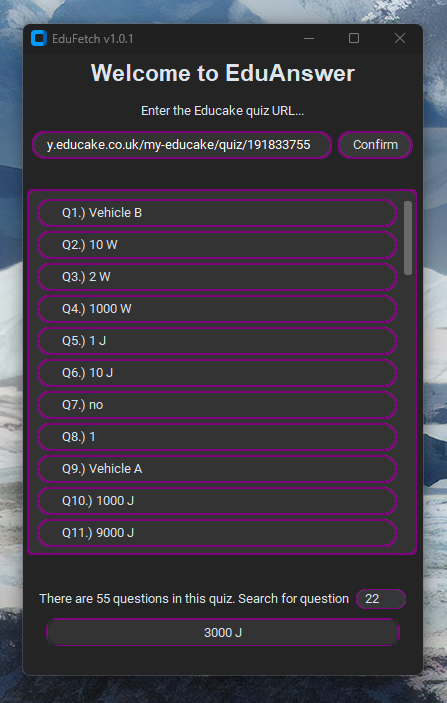
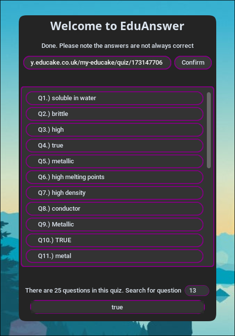

# EduAnswer V1.0.1
### ℹ️ A Python-based GUI that answers and displays Educake answers

| ***Windows*** | ***Linux*** |
| :---: | :---: |
|  |  |

***This repository contains 2 main versions of the code:***
 
- The original Python file *(commented and documented for easy understanding and addition)*
- Applications for:

  * Windows
  * Linux *(Linux executable file provided, so you might want to convert it to a .desktop)*
  * MacOS ***(Coming soon 🔜)*** 

 

## Table of Contents

<h3><a href="#-requirements">&emsp; 🛠️ Requirements</a></h3>
<h3><a href="#-installation-guide">&emsp; 🚀 Installation Guide</a></h3>
<h3><a href="#-setup-guide">&emsp; 📖 Setup Guide</a></h3>
<h3><a href="#-disclaimers">&emsp; ⚠️ Disclaimers</a></h3>
  
 
 

## 🛠️ Requirements

### **Prerequisites *(for Python file)***
- **Python 3.12+**
- External **PIP** library ***'curl_cffi'*** installed
- External **PIP** library ***'google-genai'*** installed
- External **PIP** library ***'customtkinter'*** installed
- Internet connection

### **Prerequisites *(for Application)***
- Internet connection
- Permissions to run file
- A valid **Google Gemini** API key (explained in Installation Guide)

### **Program requirements**
- URL to the quiz that you want to access (must not end in /true, remove the /true in that case)
- Valid **Educake** username (can be the email assigned to **Educake** account)
- Valid **Educake** password
 

## 🚀 Installation Guide

### <ins>**For application**</ins>
***1. ) Click on green "Code" button on the homepage of this repository, then select "Download ZIP"***...

 

#### On Windows

***2. ) Navigate to "EduAnswer-main.zip" in File Explorer, right click and press "Extract all"***

***3. ) Open the subsequent "EduAnswer-main" folder -> "EduAnswer-main" -> "Windows_Application" -> "EduAnswer.exe"***

***4.) Double click to run, and click "Run" or "Run anyway" when security prompt comes up :tada:***

  

#### On Linux

***2. ) Navigate to "EduAnswer-main.zip", and extract with your tool of choice (either your file manager's built-in archiver or Unzip utility)***

***3. ) Open the subsequent "EduAnswer-main" folder -> "EduAnswer-main" -> "Linux_Application" -> "EduAnswer"***

***4. ) Copy file path of executable, then open terminal and run  `sudo chmod +x path/that/you/copied`***

***5.) Run file via your file manager or just paste the path to the file into the terminal and hit enter :tada:***

 

 

### <ins>**For standalone Python file**</ins> 

***1. ) Click on the green "Code" button on the homepage of this repo, and select "Download ZIP"***
  
***2. ) Find the downloaded file, and extract it (if you don't know how you probably shouldn't be on this option)***

***3. ) Navigate to "EduAnswer-main" -> "EduAnswer-main" -> "EduAnswer.py" :tada:***

 

## 📖 Setup Guide 
### To start using EduAnswer once you have installed it, follow these steps
***1.) When you open the program, you will be prompted to enter your Educake username and password. Enter them correctly, and press 'confirm'. This info is needed to access Educake quizzes***   **⚠️Your info does not leave your device!**

***2.) Next, you will be prompted to enter your 'Google Gemini API key'. You can get this by going to https://aistudio.google.com/api-keys, logging in, then clicking 'Create API key' in the top left corner. Copy the API key and paste it into EduAnswer's prompt, then click confirm.***

***3.) Now the setup is done, and you will not be prompted when you open the app again. To generate answers to a quiz, simply copy the url of an Educake quiz, for example:***  
``https://my.educake.co.uk/my-educake/quiz/196512757``  

***If your educake quiz has a ``/true`` at the end, like this:***  
``https://my.educake.co.uk/my-educake/quiz/196512757/true``  
***remove it, giving you something like:***  
``https://my.educake.co.uk/my-educake/quiz/196512757``  
***then just paste it into the field in EduAnswer, and press confirm. It will take some time to generate answers***

 

## ⚠️ Disclaimers
### <ins> ***I should not be held responsible for the actions of anyone that uses this program.*** </ins>
#### This program was written as my attempt to understand, and show to others, how:
- HTTP/HTTPS requests and responses are formatted
- Security measures are implemented in HTTPS, with XSRF tokens (Cross Site Reference Forgery tokens) and JWTs (JSON Web Tokens)
- Sites interact with a client
- To send requests and get responses
- GET and POST request methods work
- Clients get a session-token (JWT) from the website
- JSON files are formatted, sent and recieved
- AI APIs calls work/are formatted
- HOw to parse API responses
#### It is not my intention for this program to be used as a way to "cheat" on Educake quizzes, but rather as an easy way to understand how websites, especially logins and submittals, truly work. What YOU do with this code is YOUR choice, not mine.
 

### <ins>***There is no 'hacking' or illegality in this program***</ins> 

#### This program does not edit Educake's servers, complete quizzes for you or perform any actions that could be deemed as 'hacking' in any way. All the questions stored on Educake are openly available to be accessed via their API, and this program merely bypasses the GUI to get the questions, and hand them over to **Google Gemini** to generate answers.
 

### <ins>***This programs's answers are not always correct***</ins> 

#### Since EduAnswer generates answers to your quizzes using **Google Gemini**, the answers produced will not always be correct, and you may occasionally encounter that the program fails for no reason. In my testing, EduAnswer gets minimal text-based questions wrong, but has an 80% sucess rate with image based questions, typically resulting in quizzes that are 95% correct. Let's just call this a feature, cause realistically it helps to dodge suspicion or detection by Educake or your teachers ;)
 

### ***Link to profile: https://github.com/kJustCoding***
### ***Link to my main repo: https://github.com/kJustCoding](https://github.com/kJustCoding/personal-coding-projects/tree/main***

#### <!-- ***educake answer bot, educake hacks, educake hacker, educake answer fetcher, educake bot, educake hacker, educake answers, educake guesser, educake solver, educake quiz solver, quiz hacks, educake answer app, desktop application, GUI, educake***-->

